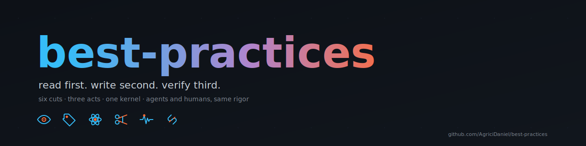
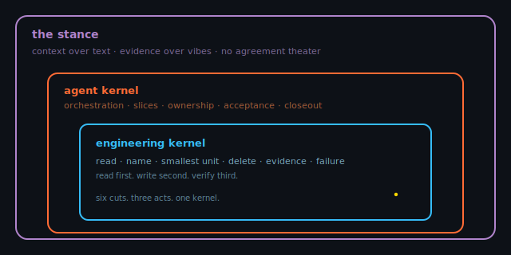

<p align="center">
  
</p>

<p align="center">
  <a href="LICENSE"></a>
  <a href="SKILL.md"></a>
  <a href="agents/openai.yaml"></a>
  <a href="https://github.com/obra/superpowers"></a>
  
</p>

# best-practices

one kernel for shipping changes. one engineering layer underneath, one agent
layer on top. small enough to reread, dense enough to matter. no fluff, no
theater, no agreement for the sake of agreement.

works as a claude code skill and slash command, a codex skill and `AGENTS.md`,
and a portable markdown kernel for cursor, antigravity, gemini cli, continue,
cline, aider, custom GPTs, and raw API harnesses.

read first. write second. verify third.

---

## the layers

<p align="center">
  
</p>

| layer              | governs       | where it lives                                              |
|--------------------|---------------|-------------------------------------------------------------|
| the stance         | how you think | [the stance](#the-stance)                                   |
| agent kernel       | the team      | [shipping-rules.md](shipping-rules.md)                      |
| engineering kernel | the diff      | this README                                                 |

each layer assumes the one below. flatten them and the hierarchy collapses.

---

## engineering kernel

six cuts. three acts. these are the rules that make any of the rest possible.
shipping-rules sits on top.

<a id="read"></a>
### before

<table>
<tr>
<td valign="top" width="56"></td>
<td>

**read before write.** code you do not understand, you cannot change. open the
call sites, the tests, the schema, the consumers. removals break assumptions
as often as additions.

</td>
</tr>
<tr>
<td valign="top" width="56"></td>
<td><a id="name"></a>

**name like the next reader is hostile.** good names carry context, bad names
hide bugs. if you cannot name it cleanly, you do not understand it yet. rename
when meaning shifts.

</td>
</tr>
</table>

<a id="small"></a>
### during

<table>
<tr>
<td valign="top" width="56"></td>
<td>

**smallest unit that works.** one purpose per unit, well-defined edges,
testable in isolation. a file growing large is a signal it is doing too much.
complexity is earned, not anticipated. no abstraction without three real
callers.

</td>
</tr>
<tr>
<td valign="top" width="56"></td>
<td><a id="delete"></a>

**delete more than you add.** code is liability, not asset. dead code, dead
tests, dead branches, dead flags. carry only what earns its weight every week.

</td>
</tr>
</table>

<a id="evidence"></a>
### after

<table>
<tr>
<td valign="top" width="56"></td>
<td>

**evidence over intuition.** measure before optimizing. profile before
guessing. read the log before assuming. trust nothing unverified, including
your own work an hour ago. if a task has no verification path, refuse it
until it does.

</td>
</tr>
<tr>
<td valign="top" width="56"></td>
<td><a id="failure"></a>

**failure is the spec.** what breaks, when, and how you recover. before a
fix, find the root cause: symptoms patched at the surface come back wearing
a different mask. design the unhappy path with the same care as the happy
one. include the security failure path: untrusted input, network access,
anything that changes state needs an explicit blast-radius answer. an undo
plan is not optional.

</td>
</tr>
</table>

these six are the kernel. internalize them and the rest of the file reads as
the consequences, not the rules.

---

## agent kernel

shipping with help (yourself, a teammate, an agent, a swarm of agents) does
not exempt rigor. it nests rigor inside coordination.

the full text lives in [shipping-rules.md](shipping-rules.md). the kernel is:

- **one chair.** every change has one human who owns the call.
- **bounded slices.** no overlapping write scopes, no implicit shared work.
- **explorers map, workers implement, verifiers gate.** roles are not labels,
  they are different read/write contracts.
- **acceptance criteria written before execution.** if you cannot write the
  bar, the slice is not ready.
- **per-change rigor inside every slice.** orchestration does not buy you out
  of the engineering kernel. it amplifies it.
- **closeout has five parts.** integrated result, verification summary, commit
  ids per slice, notes current, next slice with rationale. fewer means open.

agents produce plausible code that quietly does the wrong thing. humans do
too. same rigor, no exceptions.

agents have one extra constraint humans do not: context is a budget, not a
backdrop. degrade gracefully when full. clear when poisoned by failed
approaches. dispatch fresh-context reviewers, not the same head twice. the
reviewer who never wrote the code spots more than the writer who just
finished it.

### codex subagents

<p align="center">
  
</p>

codex makes the agent kernel concrete with
[subagents](https://developers.openai.com/codex/concepts/subagents). the main
thread stays clean: requirements, decisions, integration, closeout. subagents
take bounded noisy work: exploration, tests, triage, log analysis, or a slice
with a disjoint write scope.

do not fan out by default. codex only spawns subagents when asked explicitly,
and each subagent spends its own model and tool budget. write the acceptance
bar before the spawn. ask for summaries, not raw tool spew.

| kernel rule | codex shape |
|-------------|-------------|
| one chair | main thread owns requirements, decisions, and integration |
| bounded slices | one subagent per role or write scope |
| explorers map | `explorer` or read-only custom agents gather evidence |
| workers implement | `worker` owns one narrow slice |
| verifiers gate | fresh-context review checks bugs, security, and tests |
| context is a budget | subagents return distilled findings to the main thread |

---

## the stance

context over text. calibrated confidence. evidence over vibes. no agreement
theater. confidence is earned, not asserted. skepticism is not new
information. accountability is non-transferable: you read because you sign.

the stance is what makes the rest of this file work. without it, the kernel
becomes a checklist, and a checklist is ceremony, not rigor. the rules are
load-bearing only when the person reading them is already willing to be
wrong in public.

---

## install

clone first, copy what you need. nothing here uses curl, so it works against
private and public repos identically.

```bash
git clone https://github.com/AgriciDaniel/best-practices.git
cd best-practices
```

then pick one or more paths.

### codex: skill (auto-loads on relevant work)

```bash
mkdir -p ~/.codex/skills/best-practices/agents
cp SKILL.md ~/.codex/skills/best-practices/
cp agents/openai.yaml ~/.codex/skills/best-practices/agents/
```

codex reads `~/.codex/skills/best-practices/SKILL.md` as the loadable skill.
`agents/openai.yaml` is optional metadata for the skill list and default
prompt. the skill is global: it gives codex the kernel when the work calls for
it, but it does not make every repo inherit the kernel.

### codex: project AGENTS.md (repo-local contract)

```bash
cp AGENTS.md /path/to/your/project/AGENTS.md
```

codex reads `AGENTS.md` at the repo root. use this when the project itself
should carry the kernel for every codex session in that repository.

### codex: hybrid install (recommended)

```bash
mkdir -p ~/.codex/skills/best-practices/agents
cp SKILL.md ~/.codex/skills/best-practices/
cp agents/openai.yaml ~/.codex/skills/best-practices/agents/
cp AGENTS.md /path/to/your/project/AGENTS.md
```

the hybrid shape is intentional: `SKILL.md` is the reusable global meditation,
`AGENTS.md` is the repo-local operating contract. use both when you want codex
to remember the kernel generally and carry it specifically inside a project.

for bigger work, add codex subagents on top: ask explicitly for parallel
agents, keep read-heavy work off the main thread, and use separate write scopes
or worktrees before letting multiple agents edit at once. codex surfaces active
agent threads through `/agent`; use `/fork` only when the work truly branches.

### claude code: skill (auto-loads on relevant work)

```bash
mkdir -p ~/.claude/skills/best-practices
cp SKILL.md ~/.claude/skills/best-practices/
```

claude code reads `~/.claude/skills/best-practices/SKILL.md` and auto-injects
the kernel when the description matches your prompt. **copy `SKILL.md` only.
do not `cp -r` the whole repo into the skill dir**, that would drop `.git`
and other non-skill files alongside `SKILL.md`. only `SKILL.md` belongs in
the skill dir.

### claude code: slash command (explicit invocation)

```bash
mkdir -p ~/.claude/commands
cp best-practices.md ~/.claude/commands/
```

then `/best-practices` injects the full kernel, and `/best-practices <section>`
injects just one section. **ten** sections addressable: `stance`,
`engineering`, `agent`, `loop`, `read`, `name`, `small`, `delete`, `evidence`,
`failure`. unrecognized arguments fall through to the full kernel with a
single-line note.

### claude code: project CLAUDE.md (shared with the team)

claude code reads `CLAUDE.md` at the repo root, not `AGENTS.md`. for a
project-scoped contract, copy the kernel into `CLAUDE.md`:

```bash
cp AGENTS.md /path/to/your/project/CLAUDE.md
```

### antigravity / gemini cli / openai agents / other AGENTS.md readers

these tools read `AGENTS.md` at the repo root by convention.

```bash
cp AGENTS.md /path/to/your/project/AGENTS.md
```

for antigravity, prefer `AGENTS.md` when your version supports it. if your
setup still expects `GEMINI.md` or an antigravity-specific rules file, use a
thin wrapper there that points at `AGENTS.md`, or paste the same kernel text.

### cursor / antigravity / continue / cline / aider

each tool has its own rules file convention and the conventions move. drop the
`AGENTS.md` content into your tool's current path. starting points (verify
against current docs before committing):

- **cursor:** `.cursor/rules/best-practices.mdc` (with frontmatter wrapper).
- **antigravity:** `AGENTS.md` at repo root when supported; otherwise a thin
  `GEMINI.md` or antigravity rules wrapper that points to `AGENTS.md`.
- **continue:** `~/.continue/config.json` rules array, or older
  `.continuerules` file.
- **cline:** `.clinerules` (file or directory) at repo root.
- **aider:** pass with `--read AGENTS.md` or via `.aider.conf.yml`.

if your tool is not listed, `AGENTS.md` is plain markdown and works as a
generic rules file in any harness that loads markdown.

---

## how it composes

- needs **enforcement** for adversarial agents (rationalization guards, iron
  laws, red-flag stop-words) -> stack [obra/superpowers](https://github.com/obra/superpowers)
- needs **iron-law TDD** -> `superpowers:test-driven-development`
- needs **debugging discipline** -> `superpowers:systematic-debugging`
- needs **parallel-agent SOP** -> `superpowers:dispatching-parallel-agents`

this kernel is the meditation. those are the enforcement. compose, do not
substitute.

---

## what this is

a meditation. six axioms compressed into something you reread on a monday
morning when you forgot why you ship the way you ship. it works for a person
or an agent who already wants to be rigorous.

## what this is not

- **not a checklist.** checklists rot. kernels compress.
- **not a textbook.** textbooks are for things you forget. this is for things
  you use.
- **not exhaustive.** exhaustive lists are the enemy of rereading. six cuts is
  the point.
- **not an enforcement layer.** there is no iron-law framing here, no
  rationalization-blocking tables, no red-flag stop-words. the kernel will not
  defend itself against an agent that decides to skip steps. for that, compose
  with [obra/superpowers](https://github.com/obra/superpowers) or another
  enforcement-grade ruleset.
- **not a substitute for TDD discipline.** cuts 5 and 6 imply tests, they do
  not mandate red-green-refactor. if you need iron-law TDD, install the
  superpowers `test-driven-development` skill on top of this kernel.
- **not original in the sense of inventing axioms.** original in the sense of
  picking the load-bearing few and naming them clearly.

---

## license

MIT. fork it, rewrite it, ship it under your name. attribution appreciated,
not required.

---

<p align="center">
  <sub>built by <a href="https://github.com/AgriciDaniel">@AgriciDaniel</a> · read first. write second. verify third.</sub>
</p>
