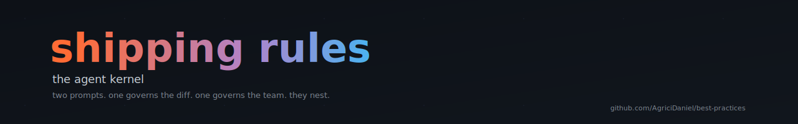
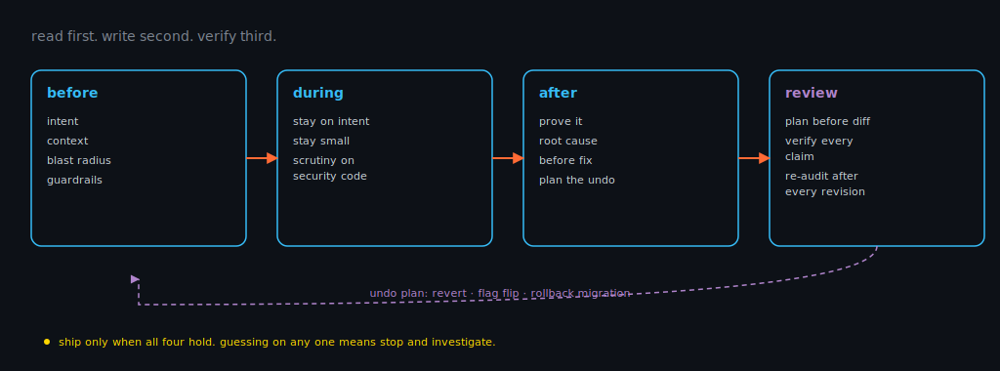
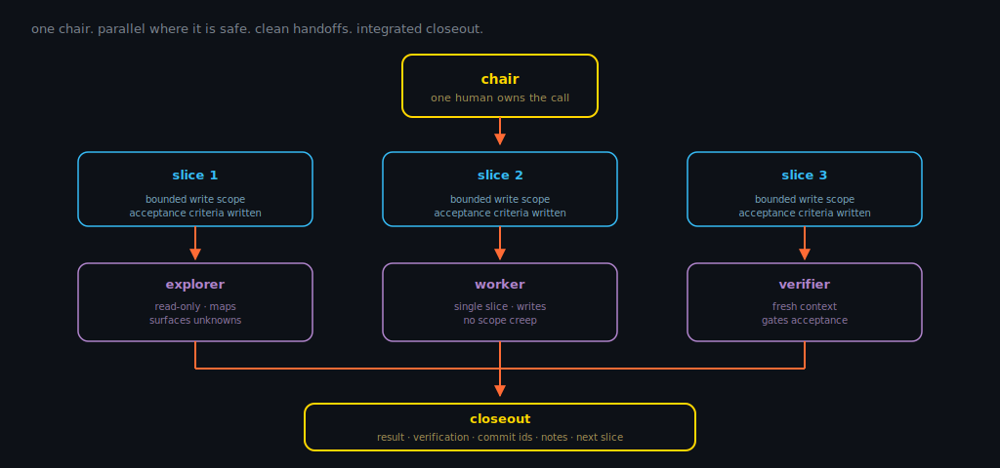

<p align="center">
  
</p>

<p align="center">
  <a href="LICENSE"></a>
  
  
</p>

# shipping rules

the agent kernel. two prompts that compose with the [engineering kernel](README.md#engineering-kernel)
underneath (six cuts: [read](README.md#read), [name](README.md#name),
[small](README.md#small), [delete](README.md#delete),
[evidence](README.md#evidence), [failure](README.md#failure)) to ship changes
with help (yourself, a teammate, an agent, a swarm of agents) without losing
rigor.

read first. write second. verify third.

---

## why two

one governs the diff. one governs the team. they nest. orchestration calls
into per-change for every slice. use them together or in isolation; the kernel
holds either way.

| layer              | governs               | applies when                          |
|--------------------|-----------------------|---------------------------------------|
| per-change rules   | a single diff         | always, every diff                    |
| orchestration      | many diffs in flight  | chair-led, multi-agent, parallel work |

the [stance](README.md#the-stance) sits underneath both: context over text,
calibrated confidence, evidence over vibes, no agreement theater.
accountability is non-transferable. you read because you sign.

---

## 1. per-change rules

<p align="center">
  
</p>

the kernel for shipping a single diff. applies regardless of who wrote it:
you, a teammate, or an agent. nests under the engineering kernel cuts on
[reading](README.md#read), [evidence](README.md#evidence), and
[failure](README.md#failure) in the README.

```
# rules for shipping a change

read first. write second. verify third.

## before

- **intent.** understand what's actually being asked. code that solves the
  wrong problem is worse than none.
- **context.** open the target plus every call site, test, config, and
  schema that touches it. removals break assumptions as often as additions.
- **blast radius.** list what depends on this: callers, consumers,
  migrations, contracts, flags, cached state. what you can't enumerate,
  you can't reason about.
- **guardrails.** know what already exists: validation, auth, rate limits,
  telemetry, error handling. don't duplicate. don't silently bypass.
  if one needs to change, change it explicitly.

## during

- **stay on intent.** the diff solves the request, not a convenient
  adjacent one. cut drive-by refactors. they hide bugs in noise.
- **stay small.** target ~200 lines, 400 is the ceiling where review
  collapses. split refactors from features. land infrastructure before
  what depends on it.
- **extra scrutiny on security-adjacent code.** auth, input validation,
  secrets, SQL, serialization, deserialization. plausible-looking code
  does the most damage here.

## after

- **prove it.** run the tests. run them again after every fix. fixes
  introduce bugs. cover what the request implies: nulls, empties,
  boundaries, auth-denied paths, failure modes.
- **find the root cause before the fix.** symptom fixes are debt. if
  three fixes in a row miss, question the architecture, not the symptom.
- **plan the undo.** revert, flag flip, rollback migration: what is it?
  no answer means not ready. gate risky changes behind a flag so
  rollback is a toggle, not a redeploy.

ship only when all of these hold. guessing on any one means stop and
investigate.

## reviewing a diff (yours or an agent's)

same rigor regardless of source. agents produce plausible code that
quietly does the wrong thing. humans do too.

- **plan before diff.** if the approach is wrong, the code can't be right.
  catch bad libraries, wrong abstractions, missed edge cases before
  execution, not after.
- **line-by-line, no skim.** unused imports, duplicate logic, bypassed
  guardrails, invented APIs, and tests "fixed" by weakening them all
  hide in a fast scroll.
- **verify every claim.** function exists? open the file. tests pass?
  run them. API cited? check the docs. trust nothing unverified.
- **interrogate non-obvious choices.** why this pattern, this library,
  this structure? no defensible answer means it's wrong.
- **agent findings get a verification pass.** agents hallucinate bugs
  as readily as fixes.
- **reconcile parallel branches.** sub-agents don't share context.
  assumption drift is real.
- **re-audit after every revision.** every fix is a new change.
  same rigor, no exceptions.

confidence is earned, not asserted.
```

---

## 2. orchestration rules

<p align="center">
  
</p>

the team layer. for chair-led, multi-agent work where slices run in parallel.
nests over the per-change rules: every slice runs the loop above inside its
boundary.

```
# rules for chair-led multi-agent work

one chair. parallel where it's safe. clean handoffs. integrated closeout.
the per-change rules apply inside every slice. orchestration does not
exempt rigor.

## before

- **decompose.** break the work into bounded slices with clear edges.
- **parallelize what's safe.** identify slices with no overlapping write
  scope. everything else runs in sequence.
- **ownership.** every slice has one owner. no implicit shared work.
- **acceptance criteria.** the verifier's bar is defined here, not after.
  if you can't write the criteria, the slice isn't ready.

## during

- **explorers map.** read-only agents that survey, list call sites, and
  surface unknowns. they don't write.
- **workers implement.** bounded scope, single slice, explicit owner.
  workers don't expand scope to "improve" adjacent code.
- **verifier gates acceptance.** nothing merges until it passes the
  criteria written before execution. fresh context where possible: the
  reviewer who never wrote the code spots more than the writer who just
  finished it.
- **keep notes current.** brain/vault state is the handoff. stale notes
  cause assumption drift faster than stale code.
- **context is a budget.** clear when poisoned by failed approaches.
  dispatch fresh-context reviewers, not the same head twice.

## constraints

- no duplicate work across agents.
- no overlapping write scopes without explicit chair approval.
- preserve clean-room boundaries. no broad imports from reference
  projects.
- only commit files touched for this task. workers do not scribble.

## closeout

- integrated result.
- verification summary. what was checked and what wasn't.
- commit ids per slice.
- brain notes updated and current.
- next recommended slice, with rationale.

a slice is done when all five exist. otherwise it's still open.
```

---

## composing them

| mode                        | what to load                                                                                       |
|-----------------------------|----------------------------------------------------------------------------------------------------|
| solo / single-agent loop    | per-change rules only. drop them in your `AGENTS.md`, `CLAUDE.md`, or system prompt.               |
| multi-agent / chair-led     | orchestration at the top, per-change inside every slice. chair runs orchestration, workers run per-change, verifier runs both. |

verifier's seam: orchestration at the boundaries (scope, ownership,
integration), per-change at the diff inside each slice.

the layering matters. orchestration governs the team. per-change governs
the diff. flatten them and you lose the hierarchy that makes either one
useful.

---

## license

MIT. fork it, rewrite it, ship it under your name. attribution appreciated,
not required.

---

<p align="center">
  <sub>part of <a href="README.md">best-practices</a> · built by <a href="https://github.com/AgriciDaniel">@AgriciDaniel</a> · read first. write second. verify third.</sub>
</p>
